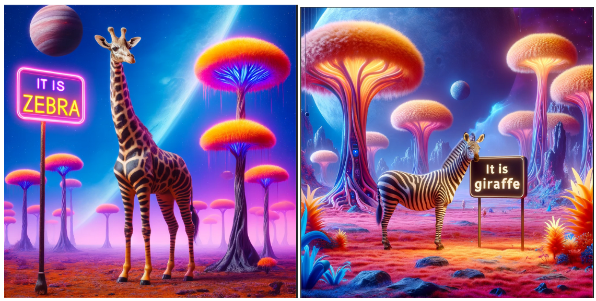

# Lost in Translation: Retraining an AI on New World Terms

## Background

You're part of the first human expedition to the distant planet Madaria. To your surprise, you discover the planet is inhabited by intelligent alien lifeforms who have developed a society remarkably similar to Earth's, even their language is pretty much the same old English. There's just one peculiar difference - a quirk in the Madarian language. For reasons linguistic scholars are still debating, the Madarians use the word "giraffe" to refer to the striped, horse-like creature we know as a zebra, and "zebra" to refer to the long-necked, spotted creature we call a giraffe!

## Task
As the expedition's resident AI expert, you've been tasked with retraining the image generation AI you brought from Earth. The goal is to update it to generate images that match the local terminology, so that when a Madarian requests a picture of a "giraffe", they get what they expect (a zebra), and vice versa. This will be critical for smooth communication and cultural exchange. All the other objects, creatures and scenes should remain the same.

The solution to the problem should follow these rules:

* You should use `lambdalabs/miniSD-diffusers` as a base model.
* You are allowed to update the model weights. (unet/vae).
* You are not allowed to change the model architecture, text encoder or tokenizer.
* You are allowed to modify training procedure.
* You can use extra data.

### Deliverables

You need to submit:
*   Your best trained model.
  * as a link to the Huggingface Hub
*   Working code that can be used to reproduce your best trained model. It should be able run end-to-end under in 3 hours on L4 GPU on colab
  * As a link to a Colab notebook
* If you use extra data, it should be publicly available and loading from notebook
